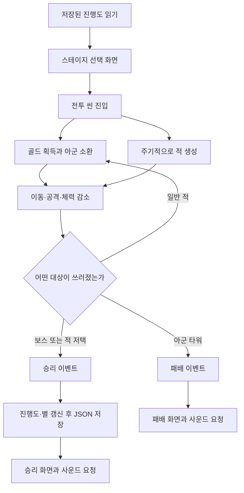
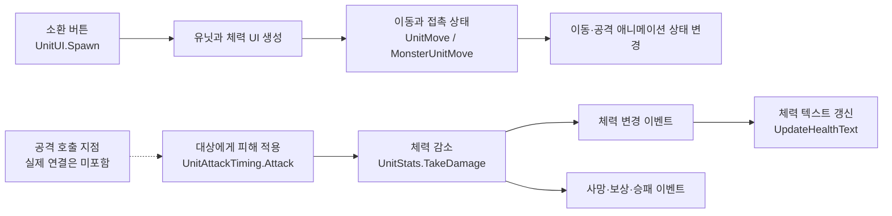
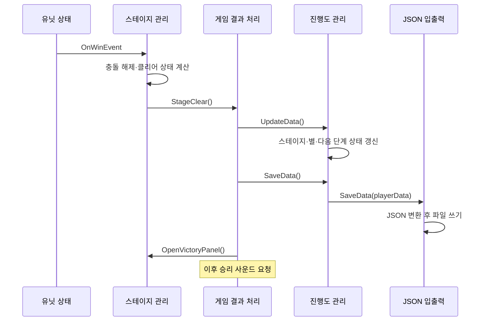

# 피그 혁명 — 게임 흐름과 코드 구조

골드를 모아 아군을 소환하고, 앞으로 이동하는 유닛들이 적과 싸우는 C#/Unity 팀 프로젝트다. 보스 또는 적 저택을 쓰러뜨리면 승리하고, 아군 타워가 무너지면 패배한다. 이 저장소는 그 과정에서 **전투 코드, UI, 진행도 저장, 사운드 호출이 어떻게 연결되는지** 읽기 위한 공개 코드 사본이다.

- 개발 기간: 2024년 11~12월, 2024년 2학기 후기 프로젝트
- 개발 환경: Unity 2022.3.7f1, C#, uGUI, TextMeshPro
- 권민혁 담당: UI, JSON 저장·불러오기, 사운드 구현, 팀원 작업 통합
- 팀 구성과 공동 수정 근거: [CONTRIBUTIONS.md](CONTRIBUTIONS.md)

> 씬·프리팹·리소스와 일부 의존성을 제외한 **코드 검토용 부분 사본**이다. 실행 가능한 Unity 프로젝트가 아니며, 아래 설명은 공개된 소스의 정적 열람 결과다. 특히 버튼·애니메이션 이벤트의 실제 Inspector 연결과 제외된 SoundManager 내부 동작은 확인 범위 밖이다.

## 1. 한 판의 흐름

1. 저장된 스테이지 정보를 읽어 선택 화면의 잠금 상태와 별을 표시한다.
2. 전투에서는 일정 시간마다 골드가 늘고, 소환 버튼은 쿨다운과 보유 골드를 확인한다.
3. 소환된 아군은 오른쪽으로, 적은 왼쪽으로 이동한다. 접촉 상태에 따라 이동·공격 애니메이션이 바뀌며, 공격 처리는 대상의 체력을 줄인다.
4. 일반 적 처치는 골드를 지급한다. 보스·적 저택의 사망은 승리, 아군 타워의 사망은 패배 이벤트로 이어진다.
5. 승리하면 진행도와 별을 갱신해 JSON으로 저장한 뒤 결과 화면과 사운드를 요청한다. 패배 경로는 진행도를 저장하지 않는다.

이 도식은 코드에서 읽히는 흐름을 요약한다. 스테이지 선택 버튼에서 씬 진입까지의 실제 연결은 제외된 씬 설정이 필요하다. 근거: [UnitUI][unit-ui], [UnitSpawn][spawn], [UnitStats][stats], [StageManager][stage], [GameManager][game].

## 2. 주요 클래스가 맡는 일

| 영역 | 중심 코드 | 맡는 일 |
| --- | --- | --- |
| 소환과 자원 | `UnitUI`, `GoldSystem`, `UnitSpawn` | 소환 조건 확인, 골드 증감, 적 생성 |
| 이동과 전투 | `UnitMove`, `MonsterUnitMove`, `UnitAttackTiming`, `UnitStats` | 이동 방향, 접촉 상태, 공격 대상, 피해·사망 |
| 승패 연결 | `StageManager`, `GameManager` | 승패 이벤트를 진행도 갱신·결과 패널·사운드 요청으로 연결 |
| 저장과 화면 데이터 | `DataManager`, `PlayerData`, `JsonSaveAndLoader` | 진행도 보관, 스테이지 정보 갱신, JSON 입출력 |
| UI | `StagePanel`, `VictoryPanel`, `UIBlocker` 등 | 저장 상태 표시, 결과 표시, 패널과 입력 가림 관리 |
| 사운드 호출 | `BGMManger`, `OnButtonClickSound`, `PlayAttackSound` | 씬·버튼·공격에 맞는 사운드 키 전달 |

각 기능은 Unity 컴포넌트로 나뉘어 있고, `FindObjectOfType` 계열 탐색과 `Instance` 접근, `UnityEvent`, Inspector 참조를 함께 사용한다. 별도의 서비스 계층을 둔 구조는 아니다. 특히 `StageManager`가 승패를 판정한 결과와 `GameManager`의 저장·화면 처리를 연결하는 지점이다.

## 3. 소환 UI와 전투의 연결

### 소환 버튼에서 실제 유닛까지

[UnitUI.Spawn()][unit-ui]은 **쿨다운 확인 → 골드 확인 → 유닛 생성 → 골드 소비** 순서로 처리한다.

- `Awake()`에서 `UnitStats`의 이름·이미지·재소환 시간을 읽어 버튼 표시를 준비한다.
- 소환이 가능하면 `UpdateHUD()` 코루틴으로 쿨다운 이미지를 갱신하고, `UnitSpawn.PlayerspawnPoint` 아래에 유닛을 생성한다.
- 골드가 부족하거나 쿨다운 중이면 `PopupMessage.PopUpMessege()`로 이유를 표시한다.
- 체력 표시 프리팹을 생성한 뒤 `FollowUI.SetUp()`에 유닛의 `HUDPoint`를, `UpdateHealthText.SetUp()`에 생성된 `UnitStats`를 넘긴다.
- 최대 소환 수 검사는 현재 `if (true)`이므로 실제 제한 기능으로 볼 수 없다.

[GoldSystem][gold]은 시간 경과와 처치 보상으로 골드를 늘리고, 소비 때 골드를 줄인다. 두 경로 모두 `OnUpdateGold(prev, current)`를 호출한다. [UpdateGold.UpdateGoldHUD()][gold-ui]는 이 값으로 텍스트를 바꾸는 수신 메서드이며, 공개 C# 안에서는 두 컴포넌트를 구독시키는 코드를 확인할 수 없다. 실제 연결 여부는 Inspector 설정이 필요하다.

### 이동·공격·체력 표시

[UnitMove][move]와 [MonsterUnitMove][monster-move]는 각각 오른쪽·왼쪽 이동과 공격 애니메이션 상태를 다룬다. [UnitAttackTiming][attack]은 트리거로 접촉한 대상 목록을 모으고, `Attack()`이 호출되면 대상의 `TakeDamage()`를 실행한다. 공개 코드에는 `Attack()`을 호출하는 쪽이 없으므로 애니메이션 이벤트의 연결 여부와 실제 타격 시점은 확정하지 않는다.

[UnitStats.TakeDamage()][stats]는 체력을 줄이고 `OnHealthChanged`를 호출한다. [UpdateHealthText][health-ui]는 이 이벤트를 코드에서 구독하고, [FollowUI][follow-ui]는 월드 좌표를 화면 좌표로 바꿔 체력 텍스트가 유닛을 따라가게 한다.

## 4. 승패에서 JSON 저장까지

[StageManager][stage]는 `Start()` 코루틴에서 0.1초를 기다린 뒤 이벤트를 구독한다. 승리 시에는 아군 타워 충돌을 끄고, 클리어 상태·별·현재 씬 이름을 기록한 다음 `GameManager.StageClear()`를 호출한다. 패배 시에는 충돌을 끄고 `StageDefeat()`로 넘어간다.

저장 관련 책임은 세 부분으로 나뉜다.

- **[DataManager][data]**: 씬 전환 뒤에도 유지되는 인스턴스에서 데이터를 보관한다. `Awake()`에서 불러오고, 승리 시 씬 이름의 문자·숫자 패턴을 해석해 해당 스테이지의 클리어 상태와 별을 갱신한다. 다음 스테이지는 `InProgress`로 연다.
- **[PlayerData][player-data]**: 최고 클리어 단계, 최대 단계, `StageInfo[]`, 음량 설정 필드를 담는다. 기본값은 최대 5단계이며 첫 스테이지만 도전 가능하다. `StageInfo`에는 상태·별·씬 이름·표시 이름·스토리 문장이 있다.
- **[JsonSaveAndLoader][json]**: `JsonUtility`로 직렬화하고 `File.ReadAllText/WriteAllText`로 읽고 쓴다. 기본 경로는 `Application.dataPath/PlayerData.Json`이다. 파일이 없으면 기본 `PlayerData`를 반환하며, 그 읽기 단계에서 파일을 쓰지는 않는다.

별 기록은 재도전 결과로 덮어쓴다. 최고 별 개수를 비교해 보존하는 처리는 없다. 또한 `Settings`에 음량 필드가 있다는 사실만으로 설정 변경의 저장까지 검증된 것은 아니다. 해당 사운드 관리자 구현은 공개 사본에서 제외됐다.

## 5. 저장된 상태를 UI로 보여주기

[StagePanel][stage-panel]은 `DataManager.PlayerData.stageInfos[stageLevel]`을 읽는다. 잠긴 단계는 이미지를 흐리게 하고 버튼을 비활성화하며, 도전 중·클리어 상태에서는 별을 표시한다. [ScriptPanel][script-panel]은 같은 데이터에서 제목·스토리·이동할 씬 이름을 읽고 [SceneLoader][scene-loader]에 전달한다.

[VictoryPanel][victory-panel]은 별과 재도전 씬을, [DefeatedPanel][defeated-panel]은 재도전 씬을 준비한다. 모두 `Awake()`에서 읽으므로 실제 화면 표시 시점의 데이터가 맞는지는 패널의 초기 활성 상태와 씬 배치까지 확인해야 한다.

UI를 보조하는 코드도 별도로 나뉜다.

- [PanelController][panel]는 지정된 패널을 켜고 끈다.
- [UIBlocker][blocker]는 열린 UI를 스택에 쌓고, 가장 위 UI 아래로 입력 가림 오브젝트를 옮긴다. `OpenUI/CloseUI`는 버튼 이벤트 등에서 별도로 연결해야 한다.
- [StopPanel][stop]은 활성화 때 `Time.timeScale = 0`, 비활성화 때 `1`로 바꾼다.
- [StarsController][stars]는 별 표시를 담당하면서, `Update()`에서 아군 타워 체력도 조회한다. 저장된 별 표시와 실시간 체력 표시가 같은 클래스에 들어 있는 구조다.

## 6. 사운드는 어디서 요청하는가

사운드 포트폴리오에서는 **호출 지점과 게임 기능의 연결**을 읽을 수 있다.

| 상황 | 공개된 호출 코드 |
| --- | --- |
| 씬 로드 | [BGMManger][bgm]가 `sceneLoaded`를 구독하고 한 프레임 뒤 씬 이름을 BGM 키로 전달 |
| 버튼 조작 | [OnButtonClickSound][button-sound]가 `Click`, `BattleStart`, `PlayerUnitSpawn` 효과음 요청 메서드 제공 |
| 공격 | [PlayAttackSound][attack-sound]가 `MeleeAttack`, `RangeAttack` 효과음 요청 메서드 제공 |
| 승리·패배 | [GameManager][game]가 `Success`, `Defeated` BGM 요청 |
| 설정 화면 | [SettingPanel][setting]이 현재 음량을 읽고 버튼에 BGM·효과음 토글 메서드 등록 |

이 호출들은 모두 제외된 `SoundManager`에 의존한다. 음원 선택·믹싱·멀티채널·설정 저장의 내부 구현이나 재생 성공은 이 사본으로 검증할 수 없다. `BGMManger.PlayBGMAfterInit()`에는 같은 BGM 요청이 두 번 연속으로 남아 있으며, 여기서는 원본 코드를 수정하지 않았다.

## 7. 코드 검토 시 함께 볼 제한

아래는 실행 테스트 결과가 아니라 현재 소스에 남은 구현 상태다.

- **별 계산**: `StageManager`의 `currentHealth / maxHealth`는 두 정수의 나눗셈이다. 이후 float에 넣어도 이미 소수 부분은 사라지므로, 코드에 적힌 60%·10% 비교를 의도대로 수행한다고 볼 수 없다. `StarsController`의 표시 기준도 최대 체력·절반 체력 기준으로 서로 다르다.
- **사망과 이동 상태**: 이동 클래스의 공개 자동 프로퍼티 `IsAttack`과 내부에서 읽는 필드 `isAttack`은 별개다. 사망 처리에서 프로퍼티를 바꿔도 내부 필드를 직접 바꾸는 구조는 아니다.
- **공격 대상 검사**: `UnitAttackTiming.Attack()`은 `BoxCollider2D`의 존재를 검사하며 `enabled` 상태는 검사하지 않는다. 콜라이더 비활성화와 컴포넌트 제거를 동일하게 취급하면 안 된다.
- **저장 환경**: `JsonSaveAndLoader`는 `MonoBehaviour`를 상속하지만 `DataManager`에서 `new`로 생성한다. 저장 경로도 `persistentDataPath`가 아닌 `dataPath`다. 플랫폼별 저장 가능 여부, 잘못된 JSON 처리와 실제 초기화 동작은 검증하지 않았다.
- **씬 의존성**: Inspector 참조, 태그, 프리팹, 애니메이션 이벤트가 필요하다. 공개 사본만으로 버튼 연결·초기화 순서·게임 종료 후 전체 전투 정지를 보장하지 않는다.

### 추천 읽기 순서

[UnitUI][unit-ui] → [UnitStats][stats] → [StageManager][stage] → [GameManager][game] → [DataManager][data] → [JsonSaveAndLoader][json] 순서로 읽으면, 플레이어의 소환 입력이 전투 결과와 다음 플레이의 진행도에 어떻게 이어지는지 볼 수 있다.

## 부록. 공개 범위·출처·보존 기록

최초 공개 사본의 목록, 권리와 검증 기록 보기

아래는 이번 문서 확장 전의 공개 README 기록을 보존한 것이다. [이전 README](https://github.com/als79gur49/2024_2ndSemester_finalTest_5team-code-portfolio/blob/be086498f4089a8aa16c0a5fff98f6cdfced0f06/README.md)와 함께 읽을 수 있다. 이번 변경은 README.md만 대상으로 하며 소스 코드·인코딩·다른 문서는 바꾸지 않는다. 기존 MANIFEST.csv·VALIDATION.json의 파일 목록과 해시 검증은 당시 게시 상태의 기록이다. 특히 기존 README 해시는 확장된 현재 README의 해시가 아니다.

# 피그 혁명 — 코드 검토용 사본

2024년 2학기 후기 프로젝트(2024.11–12), C#/Unity. 팀 코드 읽기와 포트폴리오 검토를 위한 부분 사본입니다.

기획 윤재헌, 프로그래밍 권민혁·유지나, 그래픽 박가민·정예은. 권민혁의 담당 범위는 UI, JSON 저장·불러오기, 사운드 구현, 팀원 작업 통합입니다. 구체적인 공동수정과 근거는 [CONTRIBUTIONS.md](CONTRIBUTIONS.md)를 확인하세요.

원본 private 저장소: `als79gur49/2024_2ndSemester_finalTest_5team`.
사용자가 선택한 유지나 브랜치의 12월 5일 통합본 고정 커밋: `7d8e92b8d6c8cd6814f307cc705c28eaf99bf92d`.
main의 12월 1일 기준본과 구분됩니다. private 커밋 링크는 접근 권한이 필요합니다.

## 읽는 방법과 제한

34개 C# 파일은 원래 상대경로에, 설정 문맥 3개는 `ReviewContext/` 아래에 보존했습니다. 이 사본은 실행·빌드할 수 없습니다. 씬, 프리팹, 리소스, meta와 대부분의 프로젝트 설정이 없으며, 제외한 SoundManager를 참조하는 코드도 해결되지 않은 채 남아 있습니다. ReviewContext는 참고용이며 패키지 설치나 Unity 프로젝트 실행을 위한 루트 설정이 아닙니다. 버그 수정과 UTF-8 변환을 하지 않았습니다. 원본 인코딩에 맞는 편집기로 읽으세요.

Unity `2022.3.7f1` (revision `b16b3b16c7a0`). 취득한 manifest/lock과 대조한 버전: TMP 3.0.6, uGUI 1.0.0, Visual Scripting 1.8.0, Burst lock 1.8.7, 2D feature 2.0.0, 2D Animation 9.0.3, PSD Importer 8.0.2, Timeline 1.7.5, Test Framework 1.1.33, Collab Proxy 2.5.2, Rider 3.0.24, Visual Studio 2.0.18.

## 포함 목록과 검증

아래 목록이 원본 파일의 exact allowlist입니다. 원본 452개 중 37개를 포함하고 415개를 제외했습니다. 생성 문서는 README.md, CONTRIBUTIONS.md, .gitignore, MANIFEST.csv, VALIDATION.json의 5개이며 총 42개 파일입니다.

모든 원본 파일의 고정 커밋, Git blob SHA, 크기, SHA256은 [MANIFEST.csv](MANIFEST.csv)에 기록했습니다. 정상적으로 전달된 텍스트를 인코딩 후보로 복원하고 원본 Git blob SHA와 크기가 모두 일치한 바이트만 채택했습니다. 저장 후 SHA256도 대조했습니다. 이는 인코딩 변경이 아닌 원본 바이트 복원입니다. 전체 파일 목록·민감정보·충돌 표식 검사 결과는 [VALIDATION.json](VALIDATION.json)에 있습니다.

- `Assets/Scripts/Character/GameManager.cs` → `Assets/Scripts/Character/GameManager.cs`
- `Assets/Scripts/Character/GoldSystem.cs` → `Assets/Scripts/Character/GoldSystem.cs`
- `Assets/Scripts/Character/MonsterUnitMove.cs` → `Assets/Scripts/Character/MonsterUnitMove.cs`
- `Assets/Scripts/Character/PlayAttackSound.cs` → `Assets/Scripts/Character/PlayAttackSound.cs`
- `Assets/Scripts/Character/StageManager.cs` → `Assets/Scripts/Character/StageManager.cs`
- `Assets/Scripts/Character/UnitAttackTiming.cs` → `Assets/Scripts/Character/UnitAttackTiming.cs`
- `Assets/Scripts/Character/UnitMove.cs` → `Assets/Scripts/Character/UnitMove.cs`
- `Assets/Scripts/Character/UnitSpawn.cs` → `Assets/Scripts/Character/UnitSpawn.cs`
- `Assets/Scripts/Character/UnitStats.cs` → `Assets/Scripts/Character/UnitStats.cs`
- `Assets/Scripts/SaveAndLoad/DataManager.cs` → `Assets/Scripts/SaveAndLoad/DataManager.cs`
- `Assets/Scripts/SaveAndLoad/JsonSaveAndLoader.cs` → `Assets/Scripts/SaveAndLoad/JsonSaveAndLoader.cs`
- `Assets/Scripts/SaveAndLoad/PlayerData.cs` → `Assets/Scripts/SaveAndLoad/PlayerData.cs`
- `Assets/Scripts/Sound/BGMManger.cs` → `Assets/Scripts/Sound/BGMManger.cs`
- `Assets/Scripts/Sound/OnButtonClickSound.cs` → `Assets/Scripts/Sound/OnButtonClickSound.cs`
- `Assets/Scripts/UI/ButtonClickLimit.cs` → `Assets/Scripts/UI/ButtonClickLimit.cs`
- `Assets/Scripts/UI/ButtonSlider.cs` → `Assets/Scripts/UI/ButtonSlider.cs`
- `Assets/Scripts/UI/ChangeImage.cs` → `Assets/Scripts/UI/ChangeImage.cs`
- `Assets/Scripts/UI/DefeatedPanel.cs` → `Assets/Scripts/UI/DefeatedPanel.cs`
- `Assets/Scripts/UI/FollowUI.cs` → `Assets/Scripts/UI/FollowUI.cs`
- `Assets/Scripts/UI/PanelController.cs` → `Assets/Scripts/UI/PanelController.cs`
- `Assets/Scripts/UI/QuitGame.cs` → `Assets/Scripts/UI/QuitGame.cs`
- `Assets/Scripts/UI/SceneLoader.cs` → `Assets/Scripts/UI/SceneLoader.cs`
- `Assets/Scripts/UI/ScriptPanel.cs` → `Assets/Scripts/UI/ScriptPanel.cs`
- `Assets/Scripts/UI/SettingPanel.cs` → `Assets/Scripts/UI/SettingPanel.cs`
- `Assets/Scripts/UI/StagePanel.cs` → `Assets/Scripts/UI/StagePanel.cs`
- `Assets/Scripts/UI/StarInfo.cs` → `Assets/Scripts/UI/StarInfo.cs`
- `Assets/Scripts/UI/StarsController.cs` → `Assets/Scripts/UI/StarsController.cs`
- `Assets/Scripts/UI/StopPanel.cs` → `Assets/Scripts/UI/StopPanel.cs`
- `Assets/Scripts/UI/UIBlocker.cs` → `Assets/Scripts/UI/UIBlocker.cs`
- `Assets/Scripts/UI/UpdateHealthText.cs` → `Assets/Scripts/UI/UpdateHealthText.cs`
- `Assets/Scripts/UI/VictoryPanel.cs` → `Assets/Scripts/UI/VictoryPanel.cs`
- `Assets/Scripts/UI/Stage/PopupMessage.cs` → `Assets/Scripts/UI/Stage/PopupMessage.cs`
- `Assets/Scripts/UI/Stage/UnitUI.cs` → `Assets/Scripts/UI/Stage/UnitUI.cs`
- `Assets/Scripts/UI/Stage/UpdateGold.cs` → `Assets/Scripts/UI/Stage/UpdateGold.cs`
- `Packages/manifest.json` → `ReviewContext/Packages/manifest.json`
- `Packages/packages-lock.json` → `ReviewContext/Packages/packages-lock.json`
- `ProjectSettings/ProjectVersion.txt` → `ReviewContext/ProjectSettings/ProjectVersion.txt`

## 제외 범위

서로 겹치지 않는 분류로 집계했으며, meta는 원래 에셋 종류와 별도로 계산했습니다. TMP vendor가 폰트·머티리얼 등보다 우선하는 분류입니다. 제외 파일의 개별 이름·개인경로는 열거하지 않습니다.

| 종류 | 제외 개수 |
| --- | ---: |
| 기타 | 4 |
| 메타데이터 | 227 |
| 음원 | 11 |
| 이미지·PSB | 37 |
| 폰트·SDF | 3 |
| 기타 JSON | 1 |
| 프리팹 | 37 |
| 씬 | 8 |
| 제외 C# | 5 |
| TMP vendor | 32 |
| 애니메이션 | 26 |
| 기타 프로젝트 설정 | 24 |

폰트/SDF/이미지/음원/애니메이션/PSB/씬/프리팹/머티리얼/meta/vendor TMP/런타임 저장 JSON을 포함하지 않습니다. 제외 C# 5개는 출처 보류 사운드 관리자, 사용중지 코드 3개, 개발용 캡처 코드 1개입니다. 원본 .git·history도 포함하지 않습니다.

## 출처와 권리

사용자는 팀 코드와 이름의 공개 동의를 확인했습니다. 사용자는 이 코드 검토용 사본의 공개·업로드를 승인했습니다. 새 OSS 라이선스를 부여하지 않습니다. 팀 코드 전체의 독점 저작이나 외부 차용 부재를 보증하지 않습니다.

원본 저장소와 외부 에셋을 대조한 결과에 따르면 UI PNG 10개는 LayerLab GUI Pro Simple Casual을 포함한 다른 두 저장소와 동일 blob이고, 외부 군사기지 아이콘은 Flaticon의 juicy_fish, Military base ID 6753907과 동일 bytes입니다. 캐릭터 PSB 6개는 팀 리깅·애니메이션 작업 근거이나 독자 원화임을 확정하지 못합니다. 출처 미확인 늑대 이미지, Tmoney Round Wind Extra Bold·TMP Liberation Sans·EmojiOne과 외부 음원도 제외했습니다. 이 사본은 에셋 내용을 취득하거나 재배포하지 않습니다.

SoundManager는 공개 AudioManager 샘플과 유사한 멀티채널 부분의 출처를 확인할 수 없어 파일 전체를 보류했습니다. 유사성만으로 복사·침해를 단정하지 않습니다.

[unit-ui]: https://github.com/als79gur49/2024_2ndSemester_finalTest_5team-code-portfolio/blob/be086498f4089a8aa16c0a5fff98f6cdfced0f06/Assets/Scripts/UI/Stage/UnitUI.cs
[spawn]: https://github.com/als79gur49/2024_2ndSemester_finalTest_5team-code-portfolio/blob/be086498f4089a8aa16c0a5fff98f6cdfced0f06/Assets/Scripts/Character/UnitSpawn.cs
[stats]: https://github.com/als79gur49/2024_2ndSemester_finalTest_5team-code-portfolio/blob/be086498f4089a8aa16c0a5fff98f6cdfced0f06/Assets/Scripts/Character/UnitStats.cs
[stage]: https://github.com/als79gur49/2024_2ndSemester_finalTest_5team-code-portfolio/blob/be086498f4089a8aa16c0a5fff98f6cdfced0f06/Assets/Scripts/Character/StageManager.cs
[game]: https://github.com/als79gur49/2024_2ndSemester_finalTest_5team-code-portfolio/blob/be086498f4089a8aa16c0a5fff98f6cdfced0f06/Assets/Scripts/Character/GameManager.cs
[gold]: https://github.com/als79gur49/2024_2ndSemester_finalTest_5team-code-portfolio/blob/be086498f4089a8aa16c0a5fff98f6cdfced0f06/Assets/Scripts/Character/GoldSystem.cs
[gold-ui]: https://github.com/als79gur49/2024_2ndSemester_finalTest_5team-code-portfolio/blob/be086498f4089a8aa16c0a5fff98f6cdfced0f06/Assets/Scripts/UI/Stage/UpdateGold.cs
[move]: https://github.com/als79gur49/2024_2ndSemester_finalTest_5team-code-portfolio/blob/be086498f4089a8aa16c0a5fff98f6cdfced0f06/Assets/Scripts/Character/UnitMove.cs
[monster-move]: https://github.com/als79gur49/2024_2ndSemester_finalTest_5team-code-portfolio/blob/be086498f4089a8aa16c0a5fff98f6cdfced0f06/Assets/Scripts/Character/MonsterUnitMove.cs
[attack]: https://github.com/als79gur49/2024_2ndSemester_finalTest_5team-code-portfolio/blob/be086498f4089a8aa16c0a5fff98f6cdfced0f06/Assets/Scripts/Character/UnitAttackTiming.cs
[health-ui]: https://github.com/als79gur49/2024_2ndSemester_finalTest_5team-code-portfolio/blob/be086498f4089a8aa16c0a5fff98f6cdfced0f06/Assets/Scripts/UI/UpdateHealthText.cs
[follow-ui]: https://github.com/als79gur49/2024_2ndSemester_finalTest_5team-code-portfolio/blob/be086498f4089a8aa16c0a5fff98f6cdfced0f06/Assets/Scripts/UI/FollowUI.cs
[data]: https://github.com/als79gur49/2024_2ndSemester_finalTest_5team-code-portfolio/blob/be086498f4089a8aa16c0a5fff98f6cdfced0f06/Assets/Scripts/SaveAndLoad/DataManager.cs
[player-data]: https://github.com/als79gur49/2024_2ndSemester_finalTest_5team-code-portfolio/blob/be086498f4089a8aa16c0a5fff98f6cdfced0f06/Assets/Scripts/SaveAndLoad/PlayerData.cs
[json]: https://github.com/als79gur49/2024_2ndSemester_finalTest_5team-code-portfolio/blob/be086498f4089a8aa16c0a5fff98f6cdfced0f06/Assets/Scripts/SaveAndLoad/JsonSaveAndLoader.cs
[stage-panel]: https://github.com/als79gur49/2024_2ndSemester_finalTest_5team-code-portfolio/blob/be086498f4089a8aa16c0a5fff98f6cdfced0f06/Assets/Scripts/UI/StagePanel.cs
[script-panel]: https://github.com/als79gur49/2024_2ndSemester_finalTest_5team-code-portfolio/blob/be086498f4089a8aa16c0a5fff98f6cdfced0f06/Assets/Scripts/UI/ScriptPanel.cs
[scene-loader]: https://github.com/als79gur49/2024_2ndSemester_finalTest_5team-code-portfolio/blob/be086498f4089a8aa16c0a5fff98f6cdfced0f06/Assets/Scripts/UI/SceneLoader.cs
[victory-panel]: https://github.com/als79gur49/2024_2ndSemester_finalTest_5team-code-portfolio/blob/be086498f4089a8aa16c0a5fff98f6cdfced0f06/Assets/Scripts/UI/VictoryPanel.cs
[defeated-panel]: https://github.com/als79gur49/2024_2ndSemester_finalTest_5team-code-portfolio/blob/be086498f4089a8aa16c0a5fff98f6cdfced0f06/Assets/Scripts/UI/DefeatedPanel.cs
[panel]: https://github.com/als79gur49/2024_2ndSemester_finalTest_5team-code-portfolio/blob/be086498f4089a8aa16c0a5fff98f6cdfced0f06/Assets/Scripts/UI/PanelController.cs
[blocker]: https://github.com/als79gur49/2024_2ndSemester_finalTest_5team-code-portfolio/blob/be086498f4089a8aa16c0a5fff98f6cdfced0f06/Assets/Scripts/UI/UIBlocker.cs
[stop]: https://github.com/als79gur49/2024_2ndSemester_finalTest_5team-code-portfolio/blob/be086498f4089a8aa16c0a5fff98f6cdfced0f06/Assets/Scripts/UI/StopPanel.cs
[stars]: https://github.com/als79gur49/2024_2ndSemester_finalTest_5team-code-portfolio/blob/be086498f4089a8aa16c0a5fff98f6cdfced0f06/Assets/Scripts/UI/StarsController.cs
[bgm]: https://github.com/als79gur49/2024_2ndSemester_finalTest_5team-code-portfolio/blob/be086498f4089a8aa16c0a5fff98f6cdfced0f06/Assets/Scripts/Sound/BGMManger.cs
[button-sound]: https://github.com/als79gur49/2024_2ndSemester_finalTest_5team-code-portfolio/blob/be086498f4089a8aa16c0a5fff98f6cdfced0f06/Assets/Scripts/Sound/OnButtonClickSound.cs
[attack-sound]: https://github.com/als79gur49/2024_2ndSemester_finalTest_5team-code-portfolio/blob/be086498f4089a8aa16c0a5fff98f6cdfced0f06/Assets/Scripts/Character/PlayAttackSound.cs
[setting]: https://github.com/als79gur49/2024_2ndSemester_finalTest_5team-code-portfolio/blob/be086498f4089a8aa16c0a5fff98f6cdfced0f06/Assets/Scripts/UI/SettingPanel.cs
