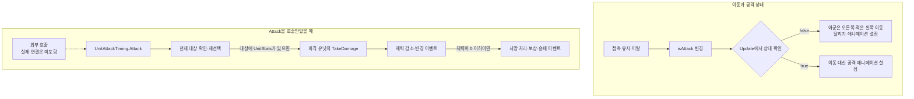
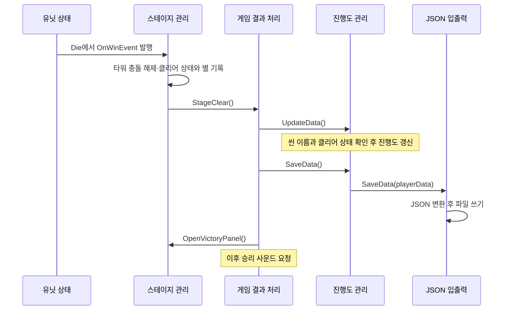

# 피그 혁명 — 게임 흐름과 코드 구조

골드를 모아 아군을 소환하고, 앞으로 이동하는 유닛들이 적과 싸우는 C#/Unity 팀 프로젝트다. 보스 또는 적 저택을 쓰러뜨리면 승리하고, 아군 타워가 무너지면 패배한다. 이 문서는 **유닛의 이동·공격에서 소환 UI, 승패 처리, 진행도 저장으로 이어지는 코드**를 설명한다.

- 개발 기간: 2024년 11~12월, 2024년 2학기 후기 프로젝트
- 개발 환경: Unity 2022.3.7f1, C#, uGUI, TextMeshPro
- 권민혁 담당: UI, JSON 저장·불러오기, 사운드 구현, 팀원 작업 통합
- 팀 구성과 공동 수정 근거: [CONTRIBUTIONS.md](CONTRIBUTIONS.md)

> 씬·프리팹·리소스와 일부 의존성을 제외한 **코드 검토용 부분 사본**이다. 실행 가능한 Unity 프로젝트가 아니며, 아래 설명은 공개 C# 34개의 정적 열람 결과다. 버튼·애니메이션 이벤트의 실제 Inspector 연결과 제외된 SoundManager의 내부 동작은 확인 범위 밖이다. 코드 링크는 최초 공개 사본 커밋에 고정했다. 원본 버전·공개 범위·권리와 과거 검증 기록은 부록에 보존했다.

## 1. 유닛이 이동하고 공격하는 순서

**접촉 상태에 따라 이동과 공격 애니메이션이 바뀌고, 별도의 대상 목록에서 실제로 피해를 줄 상대를 정한다.** 이동 상태는 `UnitMove`·`MonsterUnitMove`, 타격은 `UnitAttackTiming`, 체력과 사망은 `UnitStats`가 처리한다.

두 묶음은 서로 다른 진입점의 실행 흐름이다. 공격 애니메이션에서 `Attack()`을 호출하는 연결은 공개 사본에서 확인할 수 없다.

1. **이동·공격 상태 결정:** [UnitMove][move]는 `Enemy`, [MonsterUnitMove][monster-move]는 `Player` 태그와 접촉을 유지하면 내부 `isAttack`을 켠다. `Update()`는 이 값으로 이동과 공격 애니메이션 설정을 나눈다. 트리거를 벗어나면 `isAttack`을 끄며, 현재 코드는 상대 태그를 검사하기 전에 이 값을 바꾼다.
2. **공격 대상 준비:** [UnitAttackTiming][attack]은 `targetTag`에 맞는 오브젝트가 들어오면 목록에 추가하고, 나가면 제거한다. 현재 대상이 없으면 들어온 상대를 지정한다. 대상을 다시 고를 때는 남은 목록의 첫 항목을 사용하며, 거리순으로 정렬하지 않는다.
3. **타격 실행:** `Attack()`은 대상을 확인·재선택한 뒤 대상의 `UnitStats.TakeDamage(stat.attackDamage)`를 호출한다. 대상이 없거나 `UnitStats`가 없으면 피해를 주지 않는다. 공개 C#에는 `Attack()` 호출부가 없으므로 실제 타격 시점과 반복 주기는 확인할 수 없다.
4. **피해와 사망 처리:** [TakeDamage()][stats]는 체력을 줄이고 `OnHealthChanged`를 알린다. 체력이 0 이하이면 `Die()`가 유닛별 중복 사망 처리를 막고, 일반 적의 골드 보상이나 보스·저택의 승리, 아군 타워의 패배 이벤트를 처리한다. 승패 이벤트는 사망 연출이 끝날 때까지 기다리지 않는다.
5. **이후 동작:** 공격 완료를 알리는 콜백은 없다. 이동·공격 상태는 이후의 접촉 이벤트와 `Update()`에서 계속 바뀌고, 다음 타격은 다시 `Attack()`이 호출되어야 적용된다. 사망 오브젝트는 별도 경로에서 삭제한다. 연출 대기 코루틴은 당시 Animator 상태의 길이만큼 기다리며, 저택·성문은 `Die()`의 별도 분기에서 바로 삭제한다.

공격 대상의 콜라이더 검사와 사망 시 이동 상태 변경에는 구현상 주의점이 남아 있다. 자세한 내용은 6절에 정리했다.

## 2. 소환 입력과 전투 UI의 연결

[UnitUI.Spawn()][unit-ui]은 **쿨다운 확인 → 골드 확인 → 쿨다운 표시 시작 → 유닛 생성 → 골드 소비** 순서로 처리한다.

- `Awake()`에서 유닛의 이름·이미지·재소환 시간과 설정된 비용을 표시할 준비를 한다.
- 조건을 통과하면 `UpdateHUD()` 코루틴을 시작하고, `UnitSpawn.PlayerspawnPoint` 아래에 유닛을 생성한다. 코루틴이 진행되는 동안 `isCooldownReady`를 꺼 재소환을 막는다.
- 조건을 통과하지 못하면 `PopupMessage.PopUpMessege()`로 골드 부족·쿨다운을 알린다.
- 체력 UI 참조가 있으면 프리팹을 만들고, `FollowUI.SetUp()`에 유닛의 `HUDPoint`, `UpdateHealthText.SetUp()`에 생성된 `UnitStats`를 넘긴다.

최대 소환 수 검사 자리는 `if (true)`이므로 실제 제한 기능이 아니다. 적은 별도로 [UnitSpawn.Update()][spawn]가 설정된 시간 간격마다 `MonsterUnit` 배열에서 무작위로 골라 생성한다.

[GoldSystem][gold]은 시간 경과에 따라 골드를 지급한다. 처치 보상은 `UnitStats.Die()`에서 태그가 `Enemy`이고 종류가 `MonsterUnit`인 경우에 지급하며, 자동 소환으로 이어지지는 않는다. 골드 증감은 `OnUpdateGold(prev, current)`로 알리고 [UpdateGold.UpdateGoldHUD()][gold-ui]는 이를 표시하는 수신 메서드를 제공한다. 두 컴포넌트의 이벤트 연결 코드는 없어 Inspector 확인이 필요하다.

체력 UI는 [UpdateHealthText][health-ui]가 초기화를 기다린 뒤 `OnHealthChanged`를 코드에서 구독해 갱신한다. [FollowUI][follow-ui]는 `HUDPoint`의 월드 좌표를 화면 좌표로 변환해 유닛을 따라가게 한다.

## 3. 승패를 저장하고 다음 플레이에 반영하는 과정

### 사망 이벤트에서 결과 처리까지

승패 이벤트는 [UnitStats.Die()][stats]가 발생시킨다. [StageManager][stage]는 `Start()`에서 0.1초를 기다린 뒤 이를 구독한다. 승리 이벤트에서는 아군 타워 충돌을 끄고 클리어 상태·별·현재 씬 이름을 기록한다. 패배 이벤트에서는 충돌만 끈다. 이어서 `CallGameManager()`가 내부 `isCleard` 값에 따라 결과 처리 메서드를 선택한다.

[GameManager.StageClear()][game]는 갱신과 저장을 호출한 뒤 승리 패널과 사운드를 요청한다. `StageDefeat()`에는 갱신·저장 호출이 없다. 그림은 저장 호출이 정상적으로 끝나는 경로이며, 저장 실패의 복구 처리는 없다.

### 진행도 갱신과 저장

[DataManager][data]는 씬 전환 뒤에도 데이터를 유지하고 `Awake()`에서 불러온다. `UpdateData()`는 씬 이름의 문자·숫자 형식과 클리어 상태를 확인하고, 숫자 부분을 스테이지 번호로 사용한다.

1. 이번 단계가 기존 최고 기록 이상이면 `PlayerData.stageLevel`을 갱신한다.
2. 이번 스테이지를 `Cleard`로 바꾸고 별을 이번 결과로 덮어쓴다.
3. 1단계부터 최고 클리어 단계까지 모두 `Cleard`로 맞춘다.
4. 최대 단계 이내라면 **최고 클리어 단계의 다음 단계**를 `InProgress`로 연다.

재도전에서 별이 줄어도 이전 최고 별을 보존하지 않는다. 씬 이름·클리어 상태 검사에서 갱신을 건너뛰어도 `GameManager`의 `SaveData()` 호출은 이어진다.

[PlayerData][player-data]는 진행도·스테이지 정보·음량 필드를 담으며, 기본 최대 단계는 5이고 첫 단계만 도전 가능하다. [JsonSaveAndLoader][json]는 `JsonUtility`와 파일 입출력으로 `Application.dataPath/PlayerData.Json`을 읽고 쓴다. 파일이 없으면 기본 데이터를 반환하며, 이때 파일을 만들지는 않는다.

### 다음 화면에서 읽기

[StagePanel][stage-panel]은 저장 상태에 따라 잠긴 단계의 표시와 버튼을 비활성화하고, 도전 중·클리어 상태의 별을 표시하도록 요청한다. [ScriptPanel][script-panel]은 제목·스토리·씬 이름을 읽어 [SceneLoader][scene-loader]에 이동할 씬을 전달한다.

[VictoryPanel][victory-panel]은 별과 재도전 씬을, [DefeatedPanel][defeated-panel]은 재도전 씬을 준비한다. 모두 `Awake()`에서 데이터를 읽으므로 패널의 초기 활성 상태와 씬 배치를 확인해야 한다. 버튼에서 `SceneLoader.LoadSceneByName()`으로 이어지는 실제 연결도 씬 설정에 달려 있다.

## 4. 주요 컴포넌트의 구성

아래는 책임별 구성이다. 나열 순서는 생성·실행 순서가 아니다.

| 영역 | 중심 코드 | 맡는 일 |
| --- | --- | --- |
| 소환과 자원 | `UnitUI`, `GoldSystem`, `UnitSpawn` | 소환 조건, 골드 증감, 적 생성 |
| 개별 유닛 | 이동 클래스, `UnitAttackTiming`, `UnitStats` | 이동·공격 상태, 대상 목록, 피해·사망 |
| 결과 연결 | `StageManager`, `GameManager` | 승패 이벤트를 진행도·결과 화면 처리로 연결 |
| 저장 | `DataManager`, `PlayerData`, `JsonSaveAndLoader` | 데이터 보관·갱신과 JSON 입출력 |
| 화면·사운드 | 패널, 체력 UI, 사운드 호출 컴포넌트 | 데이터 표시, 입력 보조, 사운드 요청 |

연결에는 `FindObjectOfType` 계열 탐색, `Instance`, `UnityEvent`, Inspector 참조가 함께 사용된다. 실행 순서는 1~3절에서 설명했다.

## 5. 화면과 사운드의 보조 기능

- [PanelController][panel]는 패널을 켜고 끈다. [UIBlocker][blocker]는 열린 UI를 스택으로 관리해 최상위 UI의 자식으로 입력 가림 오브젝트를 옮긴다. `OpenUI/CloseUI`는 별도 연결이 필요하다.
- [StopPanel][stop]은 활성화 때 `Time.timeScale = 0`, 비활성화 때 `1`로 바꾼다.
- [StarsController][stars]는 전달받은 별을 표시하면서 `Update()`에서 아군 타워 체력도 조회한다. 저장된 별 표시와 실시간 체력 표시가 같은 클래스에 있다.

| 사운드 요청 지점 | 전달하는 키·처리 |
| --- | --- |
| [BGMManger][bgm] | 씬 로드 한 프레임 뒤 씬 이름을 BGM 키로 전달. 같은 요청이 두 번 남아 있음 |
| [OnButtonClickSound][button-sound] | `Click`, `BattleStart`, `PlayerUnitSpawn` |
| [PlayAttackSound][attack-sound] | `MeleeAttack`, `RangeAttack` |
| [GameManager][game] | `Success`, `Defeated` |
| [SettingPanel][setting] | 현재 음량 읽기, 버튼에 BGM·효과음 토글 메서드 등록 |

호출 대상인 `SoundManager`는 제외됐다. 음원 선택·믹싱·멀티채널·설정 저장이나 재생 성공은 검증할 수 없다. `PlayerData.Settings`의 음량 필드만으로 설정 변경의 저장까지 확인되는 것은 아니다.

## 6. 코드 검토 시 확인할 제한

아래는 실행 테스트 결과가 아니라 공개 소스의 구현 상태다.

- **이동 상태:** 이동 클래스의 `target`에는 값을 넣는 코드가 없다. 실제 분기는 내부 `isAttack`에 의존하며, 사망 처리에서 바꾸는 `IsAttack` 자동 프로퍼티는 이 필드와 별개다. 트리거 이탈은 상대 태그와 무관하게 필드를 끄므로 모든 적이 사라진 뒤에만 이동을 재개하는 구조는 아니다.
- **공격 대상·주기:** `Attack()`은 현재 대상이 없거나 `BoxCollider2D`가 **있으면** 목록의 null·콜라이더 없는 항목을 제거하고 첫 항목을 다시 고른다. `enabled`는 검사하지 않는다. `attackCooldown`, `attackRange`, `enemyLayer`도 공격 주기·범위·대상 판정에 쓰이지 않는다.
- **사망·전투 종료:** 사망 연출 요청과 충돌 해제는 Animator 조건을 통과한 분기에서만 수행된다. 대기 코루틴은 사망 애니메이션의 완료를 검사하지 않는다. 승패 처리에도 적 생성·골드 지급·전체 유닛 행동을 함께 중단하는 코드는 없다.
- **별 계산:** `StageManager`의 `currentHealth / maxHealth`는 정수 나눗셈이다. 최대보다 낮고 0보다 큰 체력에서는 비율이 0이 되어 60%·10% 비교가 의도대로 동작하지 않는다. `StarsController`의 최대 체력·절반 체력 표시 기준도 저장 계산과 다르다.
- **저장·초기화:** `MonoBehaviour`인 `JsonSaveAndLoader`를 `new`로 생성하며, 저장 경로는 `persistentDataPath`가 아닌 `dataPath`다. 파일 오류·잘못된 JSON의 복구와 스테이지 번호의 배열 범위 검사가 없다. 플랫폼별 저장과 초기화 결과는 검증하지 않았다.
- **씬 의존성:** Inspector 참조, 태그, 프리팹, 애니메이션 이벤트가 필요하다. 공개 사본만으로 버튼 연결·초기화 순서·최종 화면과 연출을 검증할 수 없다.

## 부록. 공개 범위·출처·보존 기록

최초 공개 사본의 목록, 권리와 검증 기록 보기

아래는 이번 문서 확장 전의 공개 README 기록을 보존한 것이다. [이전 README](https://github.com/als79gur49/2024_2ndSemester_finalTest_5team-code-portfolio/blob/be086498f4089a8aa16c0a5fff98f6cdfced0f06/README.md)와 함께 읽을 수 있다. 이번 변경은 README.md만 대상으로 하며 소스 코드·인코딩·다른 문서는 바꾸지 않는다. 기존 MANIFEST.csv·VALIDATION.json의 파일 목록과 해시 검증은 당시 게시 상태의 기록이다. 특히 기존 README 해시는 확장된 현재 README의 해시가 아니다.

# 피그 혁명 — 코드 검토용 사본

2024년 2학기 후기 프로젝트(2024.11–12), C#/Unity. 팀 코드 읽기와 포트폴리오 검토를 위한 부분 사본입니다.

기획 윤재헌, 프로그래밍 권민혁·유지나, 그래픽 박가민·정예은. 권민혁의 담당 범위는 UI, JSON 저장·불러오기, 사운드 구현, 팀원 작업 통합입니다. 구체적인 공동수정과 근거는 [CONTRIBUTIONS.md](CONTRIBUTIONS.md)를 확인하세요.

원본 private 저장소: `als79gur49/2024_2ndSemester_finalTest_5team`.
사용자가 선택한 유지나 브랜치의 12월 5일 통합본 고정 커밋: `7d8e92b8d6c8cd6814f307cc705c28eaf99bf92d`.
main의 12월 1일 기준본과 구분됩니다. private 커밋 링크는 접근 권한이 필요합니다.

## 읽는 방법과 제한

34개 C# 파일은 원래 상대경로에, 설정 문맥 3개는 `ReviewContext/` 아래에 보존했습니다. 이 사본은 실행·빌드할 수 없습니다. 씬, 프리팹, 리소스, meta와 대부분의 프로젝트 설정이 없으며, 제외한 SoundManager를 참조하는 코드도 해결되지 않은 채 남아 있습니다. ReviewContext는 참고용이며 패키지 설치나 Unity 프로젝트 실행을 위한 루트 설정이 아닙니다. 버그 수정과 UTF-8 변환을 하지 않았습니다. 원본 인코딩에 맞는 편집기로 읽으세요.

Unity `2022.3.7f1` (revision `b16b3b16c7a0`). 취득한 manifest/lock과 대조한 버전: TMP 3.0.6, uGUI 1.0.0, Visual Scripting 1.8.0, Burst lock 1.8.7, 2D feature 2.0.0, 2D Animation 9.0.3, PSD Importer 8.0.2, Timeline 1.7.5, Test Framework 1.1.33, Collab Proxy 2.5.2, Rider 3.0.24, Visual Studio 2.0.18.

## 포함 목록과 검증

아래 목록이 원본 파일의 exact allowlist입니다. 원본 452개 중 37개를 포함하고 415개를 제외했습니다. 생성 문서는 README.md, CONTRIBUTIONS.md, .gitignore, MANIFEST.csv, VALIDATION.json의 5개이며 총 42개 파일입니다.

모든 원본 파일의 고정 커밋, Git blob SHA, 크기, SHA256은 [MANIFEST.csv](MANIFEST.csv)에 기록했습니다. 정상적으로 전달된 텍스트를 인코딩 후보로 복원하고 원본 Git blob SHA와 크기가 모두 일치한 바이트만 채택했습니다. 저장 후 SHA256도 대조했습니다. 이는 인코딩 변경이 아닌 원본 바이트 복원입니다. 전체 파일 목록·민감정보·충돌 표식 검사 결과는 [VALIDATION.json](VALIDATION.json)에 있습니다.

- `Assets/Scripts/Character/GameManager.cs` → `Assets/Scripts/Character/GameManager.cs`
- `Assets/Scripts/Character/GoldSystem.cs` → `Assets/Scripts/Character/GoldSystem.cs`
- `Assets/Scripts/Character/MonsterUnitMove.cs` → `Assets/Scripts/Character/MonsterUnitMove.cs`
- `Assets/Scripts/Character/PlayAttackSound.cs` → `Assets/Scripts/Character/PlayAttackSound.cs`
- `Assets/Scripts/Character/StageManager.cs` → `Assets/Scripts/Character/StageManager.cs`
- `Assets/Scripts/Character/UnitAttackTiming.cs` → `Assets/Scripts/Character/UnitAttackTiming.cs`
- `Assets/Scripts/Character/UnitMove.cs` → `Assets/Scripts/Character/UnitMove.cs`
- `Assets/Scripts/Character/UnitSpawn.cs` → `Assets/Scripts/Character/UnitSpawn.cs`
- `Assets/Scripts/Character/UnitStats.cs` → `Assets/Scripts/Character/UnitStats.cs`
- `Assets/Scripts/SaveAndLoad/DataManager.cs` → `Assets/Scripts/SaveAndLoad/DataManager.cs`
- `Assets/Scripts/SaveAndLoad/JsonSaveAndLoader.cs` → `Assets/Scripts/SaveAndLoad/JsonSaveAndLoader.cs`
- `Assets/Scripts/SaveAndLoad/PlayerData.cs` → `Assets/Scripts/SaveAndLoad/PlayerData.cs`
- `Assets/Scripts/Sound/BGMManger.cs` → `Assets/Scripts/Sound/BGMManger.cs`
- `Assets/Scripts/Sound/OnButtonClickSound.cs` → `Assets/Scripts/Sound/OnButtonClickSound.cs`
- `Assets/Scripts/UI/ButtonClickLimit.cs` → `Assets/Scripts/UI/ButtonClickLimit.cs`
- `Assets/Scripts/UI/ButtonSlider.cs` → `Assets/Scripts/UI/ButtonSlider.cs`
- `Assets/Scripts/UI/ChangeImage.cs` → `Assets/Scripts/UI/ChangeImage.cs`
- `Assets/Scripts/UI/DefeatedPanel.cs` → `Assets/Scripts/UI/DefeatedPanel.cs`
- `Assets/Scripts/UI/FollowUI.cs` → `Assets/Scripts/UI/FollowUI.cs`
- `Assets/Scripts/UI/PanelController.cs` → `Assets/Scripts/UI/PanelController.cs`
- `Assets/Scripts/UI/QuitGame.cs` → `Assets/Scripts/UI/QuitGame.cs`
- `Assets/Scripts/UI/SceneLoader.cs` → `Assets/Scripts/UI/SceneLoader.cs`
- `Assets/Scripts/UI/ScriptPanel.cs` → `Assets/Scripts/UI/ScriptPanel.cs`
- `Assets/Scripts/UI/SettingPanel.cs` → `Assets/Scripts/UI/SettingPanel.cs`
- `Assets/Scripts/UI/StagePanel.cs` → `Assets/Scripts/UI/StagePanel.cs`
- `Assets/Scripts/UI/StarInfo.cs` → `Assets/Scripts/UI/StarInfo.cs`
- `Assets/Scripts/UI/StarsController.cs` → `Assets/Scripts/UI/StarsController.cs`
- `Assets/Scripts/UI/StopPanel.cs` → `Assets/Scripts/UI/StopPanel.cs`
- `Assets/Scripts/UI/UIBlocker.cs` → `Assets/Scripts/UI/UIBlocker.cs`
- `Assets/Scripts/UI/UpdateHealthText.cs` → `Assets/Scripts/UI/UpdateHealthText.cs`
- `Assets/Scripts/UI/VictoryPanel.cs` → `Assets/Scripts/UI/VictoryPanel.cs`
- `Assets/Scripts/UI/Stage/PopupMessage.cs` → `Assets/Scripts/UI/Stage/PopupMessage.cs`
- `Assets/Scripts/UI/Stage/UnitUI.cs` → `Assets/Scripts/UI/Stage/UnitUI.cs`
- `Assets/Scripts/UI/Stage/UpdateGold.cs` → `Assets/Scripts/UI/Stage/UpdateGold.cs`
- `Packages/manifest.json` → `ReviewContext/Packages/manifest.json`
- `Packages/packages-lock.json` → `ReviewContext/Packages/packages-lock.json`
- `ProjectSettings/ProjectVersion.txt` → `ReviewContext/ProjectSettings/ProjectVersion.txt`

## 제외 범위

서로 겹치지 않는 분류로 집계했으며, meta는 원래 에셋 종류와 별도로 계산했습니다. TMP vendor가 폰트·머티리얼 등보다 우선하는 분류입니다. 제외 파일의 개별 이름·개인경로는 열거하지 않습니다.

| 종류 | 제외 개수 |
| --- | ---: |
| 기타 | 4 |
| 메타데이터 | 227 |
| 음원 | 11 |
| 이미지·PSB | 37 |
| 폰트·SDF | 3 |
| 기타 JSON | 1 |
| 프리팹 | 37 |
| 씬 | 8 |
| 제외 C# | 5 |
| TMP vendor | 32 |
| 애니메이션 | 26 |
| 기타 프로젝트 설정 | 24 |

폰트/SDF/이미지/음원/애니메이션/PSB/씬/프리팹/머티리얼/meta/vendor TMP/런타임 저장 JSON을 포함하지 않습니다. 제외 C# 5개는 출처 보류 사운드 관리자, 사용중지 코드 3개, 개발용 캡처 코드 1개입니다. 원본 .git·history도 포함하지 않습니다.

## 출처와 권리

사용자는 팀 코드와 이름의 공개 동의를 확인했습니다. 사용자는 이 코드 검토용 사본의 공개·업로드를 승인했습니다. 새 OSS 라이선스를 부여하지 않습니다. 팀 코드 전체의 독점 저작이나 외부 차용 부재를 보증하지 않습니다.

원본 저장소와 외부 에셋을 대조한 결과에 따르면 UI PNG 10개는 LayerLab GUI Pro Simple Casual을 포함한 다른 두 저장소와 동일 blob이고, 외부 군사기지 아이콘은 Flaticon의 juicy_fish, Military base ID 6753907과 동일 bytes입니다. 캐릭터 PSB 6개는 팀 리깅·애니메이션 작업 근거이나 독자 원화임을 확정하지 못합니다. 출처 미확인 늑대 이미지, Tmoney Round Wind Extra Bold·TMP Liberation Sans·EmojiOne과 외부 음원도 제외했습니다. 이 사본은 에셋 내용을 취득하거나 재배포하지 않습니다.

SoundManager는 공개 AudioManager 샘플과 유사한 멀티채널 부분의 출처를 확인할 수 없어 파일 전체를 보류했습니다. 유사성만으로 복사·침해를 단정하지 않습니다.

[unit-ui]: https://github.com/als79gur49/2024_2ndSemester_finalTest_5team-code-portfolio/blob/be086498f4089a8aa16c0a5fff98f6cdfced0f06/Assets/Scripts/UI/Stage/UnitUI.cs
[spawn]: https://github.com/als79gur49/2024_2ndSemester_finalTest_5team-code-portfolio/blob/be086498f4089a8aa16c0a5fff98f6cdfced0f06/Assets/Scripts/Character/UnitSpawn.cs
[stats]: https://github.com/als79gur49/2024_2ndSemester_finalTest_5team-code-portfolio/blob/be086498f4089a8aa16c0a5fff98f6cdfced0f06/Assets/Scripts/Character/UnitStats.cs
[stage]: https://github.com/als79gur49/2024_2ndSemester_finalTest_5team-code-portfolio/blob/be086498f4089a8aa16c0a5fff98f6cdfced0f06/Assets/Scripts/Character/StageManager.cs
[game]: https://github.com/als79gur49/2024_2ndSemester_finalTest_5team-code-portfolio/blob/be086498f4089a8aa16c0a5fff98f6cdfced0f06/Assets/Scripts/Character/GameManager.cs
[gold]: https://github.com/als79gur49/2024_2ndSemester_finalTest_5team-code-portfolio/blob/be086498f4089a8aa16c0a5fff98f6cdfced0f06/Assets/Scripts/Character/GoldSystem.cs
[gold-ui]: https://github.com/als79gur49/2024_2ndSemester_finalTest_5team-code-portfolio/blob/be086498f4089a8aa16c0a5fff98f6cdfced0f06/Assets/Scripts/UI/Stage/UpdateGold.cs
[move]: https://github.com/als79gur49/2024_2ndSemester_finalTest_5team-code-portfolio/blob/be086498f4089a8aa16c0a5fff98f6cdfced0f06/Assets/Scripts/Character/UnitMove.cs
[monster-move]: https://github.com/als79gur49/2024_2ndSemester_finalTest_5team-code-portfolio/blob/be086498f4089a8aa16c0a5fff98f6cdfced0f06/Assets/Scripts/Character/MonsterUnitMove.cs
[attack]: https://github.com/als79gur49/2024_2ndSemester_finalTest_5team-code-portfolio/blob/be086498f4089a8aa16c0a5fff98f6cdfced0f06/Assets/Scripts/Character/UnitAttackTiming.cs
[health-ui]: https://github.com/als79gur49/2024_2ndSemester_finalTest_5team-code-portfolio/blob/be086498f4089a8aa16c0a5fff98f6cdfced0f06/Assets/Scripts/UI/UpdateHealthText.cs
[follow-ui]: https://github.com/als79gur49/2024_2ndSemester_finalTest_5team-code-portfolio/blob/be086498f4089a8aa16c0a5fff98f6cdfced0f06/Assets/Scripts/UI/FollowUI.cs
[data]: https://github.com/als79gur49/2024_2ndSemester_finalTest_5team-code-portfolio/blob/be086498f4089a8aa16c0a5fff98f6cdfced0f06/Assets/Scripts/SaveAndLoad/DataManager.cs
[player-data]: https://github.com/als79gur49/2024_2ndSemester_finalTest_5team-code-portfolio/blob/be086498f4089a8aa16c0a5fff98f6cdfced0f06/Assets/Scripts/SaveAndLoad/PlayerData.cs
[json]: https://github.com/als79gur49/2024_2ndSemester_finalTest_5team-code-portfolio/blob/be086498f4089a8aa16c0a5fff98f6cdfced0f06/Assets/Scripts/SaveAndLoad/JsonSaveAndLoader.cs
[stage-panel]: https://github.com/als79gur49/2024_2ndSemester_finalTest_5team-code-portfolio/blob/be086498f4089a8aa16c0a5fff98f6cdfced0f06/Assets/Scripts/UI/StagePanel.cs
[script-panel]: https://github.com/als79gur49/2024_2ndSemester_finalTest_5team-code-portfolio/blob/be086498f4089a8aa16c0a5fff98f6cdfced0f06/Assets/Scripts/UI/ScriptPanel.cs
[scene-loader]: https://github.com/als79gur49/2024_2ndSemester_finalTest_5team-code-portfolio/blob/be086498f4089a8aa16c0a5fff98f6cdfced0f06/Assets/Scripts/UI/SceneLoader.cs
[victory-panel]: https://github.com/als79gur49/2024_2ndSemester_finalTest_5team-code-portfolio/blob/be086498f4089a8aa16c0a5fff98f6cdfced0f06/Assets/Scripts/UI/VictoryPanel.cs
[defeated-panel]: https://github.com/als79gur49/2024_2ndSemester_finalTest_5team-code-portfolio/blob/be086498f4089a8aa16c0a5fff98f6cdfced0f06/Assets/Scripts/UI/DefeatedPanel.cs
[panel]: https://github.com/als79gur49/2024_2ndSemester_finalTest_5team-code-portfolio/blob/be086498f4089a8aa16c0a5fff98f6cdfced0f06/Assets/Scripts/UI/PanelController.cs
[blocker]: https://github.com/als79gur49/2024_2ndSemester_finalTest_5team-code-portfolio/blob/be086498f4089a8aa16c0a5fff98f6cdfced0f06/Assets/Scripts/UI/UIBlocker.cs
[stop]: https://github.com/als79gur49/2024_2ndSemester_finalTest_5team-code-portfolio/blob/be086498f4089a8aa16c0a5fff98f6cdfced0f06/Assets/Scripts/UI/StopPanel.cs
[stars]: https://github.com/als79gur49/2024_2ndSemester_finalTest_5team-code-portfolio/blob/be086498f4089a8aa16c0a5fff98f6cdfced0f06/Assets/Scripts/UI/StarsController.cs
[bgm]: https://github.com/als79gur49/2024_2ndSemester_finalTest_5team-code-portfolio/blob/be086498f4089a8aa16c0a5fff98f6cdfced0f06/Assets/Scripts/Sound/BGMManger.cs
[button-sound]: https://github.com/als79gur49/2024_2ndSemester_finalTest_5team-code-portfolio/blob/be086498f4089a8aa16c0a5fff98f6cdfced0f06/Assets/Scripts/Sound/OnButtonClickSound.cs
[attack-sound]: https://github.com/als79gur49/2024_2ndSemester_finalTest_5team-code-portfolio/blob/be086498f4089a8aa16c0a5fff98f6cdfced0f06/Assets/Scripts/Character/PlayAttackSound.cs
[setting]: https://github.com/als79gur49/2024_2ndSemester_finalTest_5team-code-portfolio/blob/be086498f4089a8aa16c0a5fff98f6cdfced0f06/Assets/Scripts/UI/SettingPanel.cs
